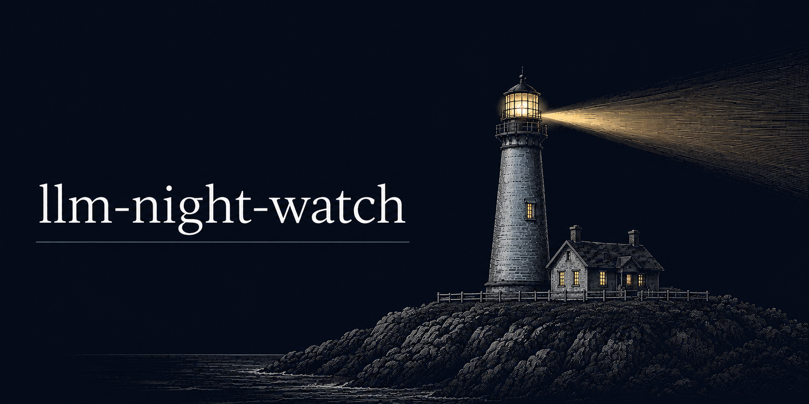
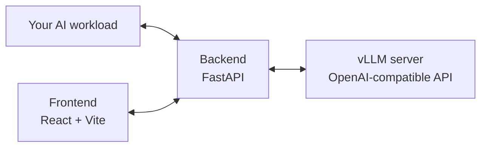

# LLM Night Watch

### The self-hosted AI stack that continuously improves itself




</a>

Exists next to your self-hosted LLM, re-checks outputs during low gpu utilization to continuously improve the model.

## Quickstart

```bash
npm i
npm run dev
```

## Architecture



## Roadmap

- Idle-GPU verification: run an agentic workflow on spare capacity to verify predictions
- Output-quality detection: auto-flag anomalous outputs
- Workload adapters for open-weight inference systems

## Contact

Running open-weight inference in production? I want to hear what you're running.
[@tschillaciml](https://x.com/tschillaciml)

Leave a star if this is helpful.
