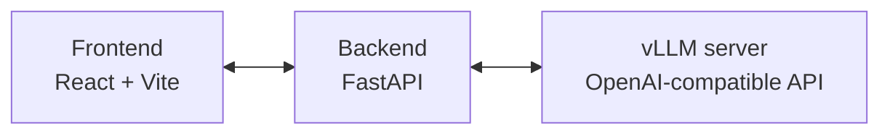

# LLM Night Watch

### The self-hosted AI stack that continuously improves itself


</a>

Exists next to your self-hosted LLM, re-checks outputs during low gpu utilization to continuously improve the model.

## Architecture



## Quickstart

```bash
npm i
cp backend/.env.template backend/.env   # then edit
npm run dev
```

## Example

In the manual tab, upload a PDF, specify the fields you want to extract. The backend renders page 1, converts it to a B/W JPEG, base64-encodes it, and calls the chat-completions endpoint with the frontend's prompt and response format (temperature `0`, 512 max tokens).

The frontend sends a **100 DPI** request first for a fast result, then a **200 DPI** request, switching the review view to the verified result. Fast pass for speed, heavier pass for confidence.

## Roadmap

- Idle-GPU verification: run an agentic workflow on spare capacity to verify predictions
- Output-quality detection: auto-flag anomalous outputs
- Beyond extraction: generalize the loop to other open-weight workloads

## Contact

Running open-weight inference in production? I want to hear what you're running.
[@tschillaciml](https://x.com/tschillaciml)

🌟 Leave a star if this is helpful!
